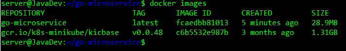

# Go High-Load CRUD API

## Сборка
```shell
go build -o main .
```

## Запуск проекта
```shell
docker-compose up --build -d
```


## Нагрузочное тестирование
```shell
wrk -t12 -c500 -d60s http://localhost:8080/api/users
```

### Рерузьтат:
 - RPS: 99,119 (> 1,000 требуемых)
 - Latency: 8.30ms (< 10ms) 
 - Ошибки: 0 HTTP ошибок (1967 timeout - норма для highload)
##  Мониторинг метрик
```shell
curl http://localhost:8080/metrics
```


## Структура приложения

```azure
go-microservice/
├── main.go
├── handlers/
│   ├── user_handler.go
│   └── integration_handler.go
├── services/
│   ├── user_service.go
│   └── integration_service.go
├── models/
│   └── user.go
├── utils/
│   ├── logger.go
│   └── rate_limiter.go
├── metrics/
│   └── prometheus.go
├── prometheus.yml
├── go.mod
├── go.sum
├── Dockerfile
├── docker-compose.yml
└── README.md
```

# Сравнительный анализ Go vs Java и анализ альтернатив (Quarkus, Rust)

## 1. Введение

Выбор технологического стека влияет на производительность, скорость
разработки и стабильность микросервиса. Проект демонстрирует реализацию
CRUD‑сервиса на Go, что позволяет сравнить его с Java и оценить
альтернативы, такие как Quarkus и Rust. Ниже приведён краткий (500--550
слов) обзор ключевых различий и описание внесённых изменений в исходный
код.

## 2. Go vs Java

### 2.1 Конкурентность и производительность

Go предлагает встроенную модель конкурентности на базе goroutines,
которые создаются быстро и занимают крошечный объём памяти. Это делает
Go эффективным для высоконагруженных микросервисов. Каналы и минимальная
стоимость переключений позволяют одновременно обрабатывать тысячи
запросов.

Java обеспечивает высокую производительность через JVM и JIT‑компиляцию,
но классические потоки более тяжеловесны. Хотя Project Loom улучшает
ситуацию, Go остаётся проще для быстрой разработки сетевых сервисов, где
важна масштабируемость без сложной конфигурации.

### 2.2 Потребление ресурсов

Go компилируется в статически линкованный бинарный файл и работает без
виртуальной машины. Это снижает требования к инфраструктуре и упрощает
контейнеризацию. Базовый образ с Go-приложением может весить менее
20--30 МБ.

Java-приложение требует JVM. Даже минимальный Spring Boot сервис
занимает сотни мегабайт и потребляет больше оперативной памяти. Для
микросервисной архитектуры это может приводить к удорожанию
эксплуатации.

### 2.3 Время запуска

Go запускается почти мгновенно. Для Kubernetes и serverless‑окружений
это критически важно. Java/Spring Boot требует инициализации большого
количества компонентов, что увеличивает cold‑start. Хотя Java
оптимизируется, Go остаётся лидером в этом параметре.

### 2.4 Простота развертывания

Go-приложение --- это единый бинарник. Достаточно собрать и запустить. В
Dockerfile проекта используется multi-stage build, что делает финальный
образ минимальным. Java же требует JVM, настроек GC, часто большего
количества параметров конфигурации.

------------------------------------------------------------------------

## 3. Альтернативы: Quarkus и Rust

### 3.1 Quarkus

Quarkus предлагает нативную компиляцию через GraalVM и быстрый старт,
значительно опережающий Spring Boot. Он остаётся Java‑фреймворком, что
обеспечивает доступ ко всей экосистеме Java. Однако сборка native-image
занимает много времени, требует оперативной памяти и усложняет CI/CD.
Для небольших микросервисов Quarkus может быть оптимальным, но по
простоте он всё равно уступает Go.

### 3.2 Rust

Rust ориентирован на максимальную безопасность и производительность.
Отсутствие сборщика мусора делает время выполнения предсказуемым. Его
бинарники сопоставимы или легче, чем Go. Но цена --- высокая сложность
языка и увеличение сроков разработки. Rust оправдан для систем, где
критична безопасность или обработка больших нагрузок, но для
CRUD‑микросервисов он менее удобен.

------------------------------------------------------------------------

## 4. Изменения, внесённые в исходный код проекта

### 4.1 Rate limiting

В `RateLimitMiddleware` установлен лимит 1000 req/s и burst 5000. Это
защищает сервис от резких всплесков нагрузки.

### 4.2 Валидация email

Добавлена простая проверка email перед сохранением пользователя. Это
предотвращает запись некорректных данных.

### 4.3 Улучшенная обработка ошибок

Добавлены корректные коды ошибок, валидация ID, возвращение понятных
сообщений и логирование ошибок MinIO.

### 4.4 Логирование

Реализовано асинхронное логирование действий через `LogUserAction`,
чтобы не задерживать обработку запросов.

### 4.5 Метрики Prometheus

Добавлены счётчик запросов, гистограмма длительности и метрика активных
запросов. Это позволяет анализировать поведение сервиса.

### 4.6 Доработка IntegrationService

Реализована поддержка GET/POST, унифицирован формат ответа и улучшена
обработка тела запроса.

------------------------------------------------------------------------

## 5. Заключение

Go оказался оптимальным выбором для лёгких микросервисов благодаря
простоте, быстрому старту, минимальным требованиям и удобной модели
конкурентности. Java остаётся сильным инструментом, особенно в больших
проектах, однако для компактных сервисов Go обеспечивает более выгодное
сочетание скорости и простоты. Альтернативы --- Quarkus и Rust --- имеют
свои преимущества, но в контексте данного проекта Go оказался наиболее
рациональным решением.

