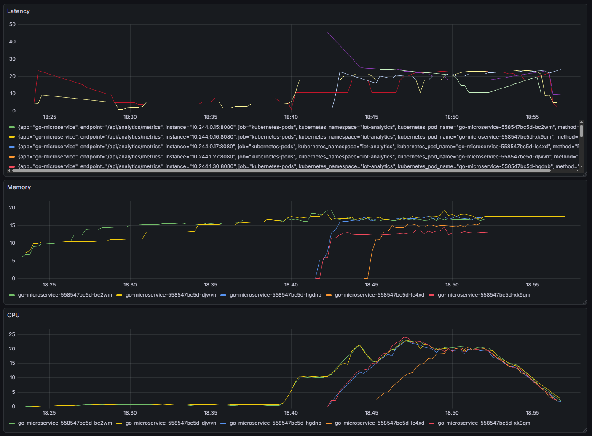

# Высоконагруженный IoT сервис с AI-оптимизацией на Go

## О проекте

Сервис для обработки потоковых метрик от IoT-устройств с аналитикой нагрузки, обнаружением аномалий и автоматическим
масштабированием в Kubernetes. Обрабатывает более 1000 RPS с latency < 50мс.

## Технические требования

- Go 1.24+
- Docker & Docker Compose
- Kubernetes (Minikube/Kind)
- Redis
- Prometheus + Grafana
- Обработка >= 1000 RPS
- Точность детекции >70%
- False positive <10%

## Kubernetes

### 1. Minikube

```bash
curl -LO https://storage.googleapis.com/minikube/releases/latest/minikube-linux-amd64
sudo install minikube-linux-amd64 /usr/local/bin/minikube
minikube version
# Запуск кластера
minikube start --cpus=6 --memory=10000mb --nodes=2
minikube status
#	Конфигурация
curl -LO https://dl.k8s.io/v1.34.1/bin/linux/amd64/kubectl
sudo install -o root -g root -m 0755 kubectl /usr/local/bin/kubectl
kubectl cluster-info
kubectl get nodes
#	Подготовка кластера:
kubectl get pods -n kube-system
minikube addons enable ingress
minikube addons enable metrics-server
#	Проверка
kubectl get pods -A
```


### 2. Docker build

```shell
docker build -t go-microservice:latest .
minikube image load go-microservice:latest
```


### 3. Deploy

```shell
kubectl create namespace iot-analytics
kubectl apply -f k8s/redis-deployment.yaml -n iot-analytics
kubectl apply -f k8s/configmap.yaml -n iot-analytics
kubectl apply -f k8s/deployment.yaml -n iot-analytics
kubectl apply -f k8s/hpa.yaml -n iot-analytics
kubectl apply -f k8s/prometheus-deployment.yaml -n iot-analytics
kubectl apply -f k8s/grafana-deployment.yaml -n iot-analytics
kubectl get all -n iot-analytics
```
```shell
# Удали только микросервис, Redis и Prometheus
kubectl delete deployment go-microservice redis prometheus -n iot-analytics

# Запусти снова
kubectl apply -f k8s/redis-deployment.yaml
kubectl apply -f k8s/deployment.yaml
kubectl apply -f k8s/prometheus-deployment.yaml
```




### 4. Пробрасываем порты grafana

```shell
kubectl port-forward svc/grafana 3000:3000 -n iot-analytics --address='0.0.0.0'
```

````### 5. Grafana графики

- Панель 1: Нагрузка и RPS

```cookie
Тип: Time series
Запрос 1: rate(http_requests_total[1m])
Запрос 2: rolling_average_rps
```

- Панель 2: Аномалии

```cookie
Тип: Stat
Запрос 1: anomalies_detected_total
Тип: Gauge
Запрос 2: anomalies_detected_total / metrics_processed_total * 100
Тип: Time series
Запрос 3: rate(anomalies_detected_total[5m])
```

- Панель 3: Производительность

```cookie
Тип: Time series
Запрос 1: rate(process_cpu_seconds_total[5m]) * 100
Тип: Time series
Запрос 2: histogram_quantile(0.95, rate(http_request_duration_seconds_bucket[5m])) * 1000
```````

## Нагрузочное тестирование

```bash
kubectl apply -f k8s/load-test-job.yaml -n iot-analytics

# В терминале 1 - логи теста
kubectl logs -f job/load-test -n iot-analytics

# В терминале 2 - автоскейлинг
watch -n 2 'kubectl get hpa,pods -n iot-analytics'
```


## Неудачи
Сходу нагрузка не пошла, в связи с тем, что load-test отправляет запросы напрямую на go-microservice
```bash
# Было:
curl -s -X POST http://go-microservice/api/analytics/metrics

# Стало (добавь namespace):
curl -s -X POST http://go-microservice.iot-analytics.svc.cluster.local/api/analytics/metrics
```


## Структура проекта
