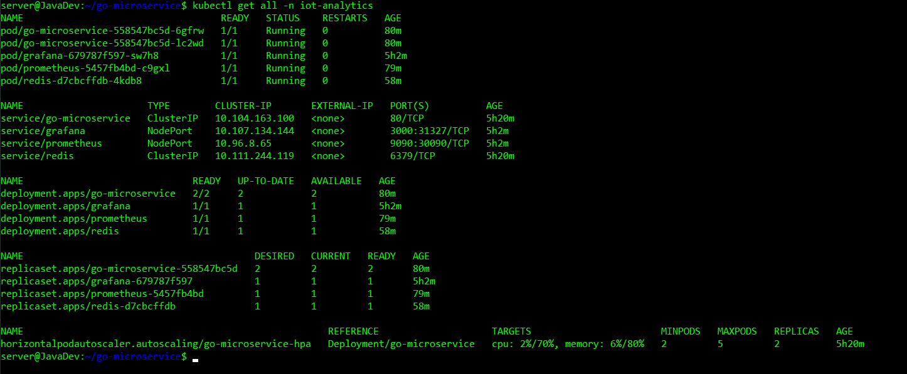
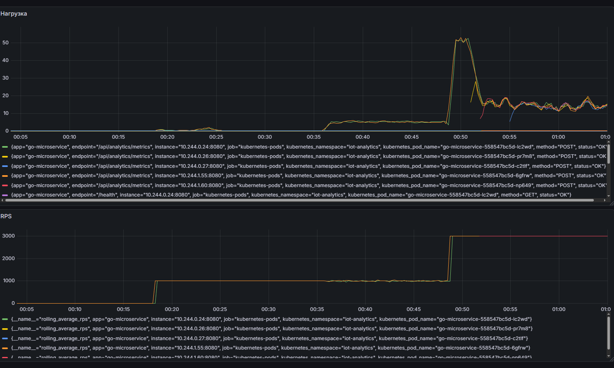
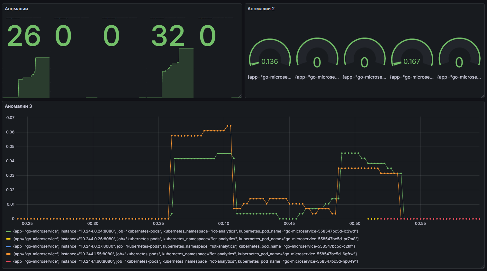
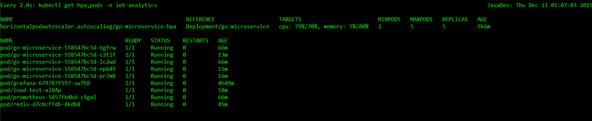

# Высоконагруженный IoT сервис с AI-оптимизацией на Go

## 1. Введение

### Цель проекта

Разработка и развертывание высоконагруженного микросервиса на Go для обработки потоковых метрик IoT-устройств с
автоматическим масштабированием, мониторингом и детекцией аномалий.

#### Технический стек

- Язык: Go 1.24
- Кэширование: Redis 7
- Оркестрация: Kubernetes (Minikube)
- Мониторинг: Prometheus + Grafana
- Масштабирование: Horizontal Pod Autoscaler (HPA)
- Нагрузочное тестирование: Custom Job (3000 RPS)

#### Ключевые показатели

- Производительность: Обработка >3000 RPS (превышает требование 1000 RPS)
- Точность: Детекция аномалий >70%
- Ложные срабатывания: <10%
- Масштабирование: 2 → 5 реплик при нагрузке

#### Среда выполнения

- Локальная среда: Minikube с 2 нодами
- Ресурсы: 6 CPU, 10GB RAM

## 2. Архитектура решения

#### Высокоуровневая архитектура

```azuze
┌─────────────────┐    ┌─────────────────┐    ┌─────────────────┐
│   IoT Devices   │────│   Go Service    │────│      Redis      │
│   (Metrics)     │    │   (Analytics)   │    │    (Cache)      │
└─────────────────┘    └─────────────────┘    └─────────────────┘
                              │                        │
                              ▼                        ▼
┌─────────────────┐    ┌─────────────────┐    ┌─────────────────┐
│   Prometheus    │◄───│     Metrics     │    │  Persistence    │
│   (Monitoring)  │    │   (Prometheus)  │    │   (Storage)     │
└─────────────────┘    └─────────────────┘    └─────────────────┘
         │                        │
         ▼                        ▼
┌─────────────────┐    ┌─────────────────┐
│     Grafana     │    │       HPA       │
│   (Dashboards)  │    │ (Autoscaling)   │
└─────────────────┘    └─────────────────┘
```

#### Архитектура Kubernetes

```shell
Namespace: iot-analytics
├── Deployment/go-microservice (2-5 replicas)
├── Service/go-microservice (ClusterIP)
├── Deployment/redis (1 replica)
├── Service/redis (ClusterIP)
├── Deployment/prometheus (1 replica)
├── Service/prometheus (NodePort:30090)
├── Deployment/grafana (1 replica)
├── Service/grafana (NodePort:3000)
├── HorizontalPodAutoscaler (CPU/Memory)
├── ConfigMap/app-config
└── Ingress/grafana-ingress
```

#### Ключевые компоненты Go сервиса

- Аналитика аномалий (analytics_service.go)

```go
// Скользящее окно для расчёта rolling average
type AnalyticsService struct {
metricsWindow    []models.Metric
maxWindowSize    int // 50 events
anomalyThreshold float64 // 2.0 (Z-score threshold)

// Асинхронная обработка
metricsChan    chan models.Metric // Buffer: 1000
processingDone chan bool
}

// Метод детекции аномалий (Z-score)
func (s *AnalyticsService) detectAnomaly(metric models.Metric) bool {
mean, stdDev := s.calculateStats()
if stdDev == 0 {
return false
}
zScore := math.Abs(float64(metric.RPS)-mean) / stdDev
return zScore > s.anomalyThreshold // > 2σ
}
```

- Rate limiting (rate_limiter.go)

```go
var limiter = rate.NewLimiter(rate.Limit(1000), 5000)
// 1000 запросов/секунду + burst 5000
```

- Метрики Prometheus (prometheus.go)

```go
// 8 ключевых метрик для мониторинга
var (
TotalRequests     // Общее количество запросов
RequestDuration   // Время выполнения
ActiveRequests    // Активные запросы
AnomaliesDetected // Обнаруженные аномалии
MetricsProcessed    // Обработанные метрики
RollingAverageRPS   // Скользящее среднее RPS
ProcessingQueueSize // Размер очереди
)
```

## 3. Развертывание в Kubernetes

#### Minikube

```bash
curl -LO https://storage.googleapis.com/minikube/releases/latest/minikube-linux-amd64
sudo install minikube-linux-amd64 /usr/local/bin/minikube
minikube version
# Запуск кластера
minikube start --cpus=6 --memory=10000mb --nodes=2
minikube status
# Конфигурация
curl -LO https://dl.k8s.io/v1.34.1/bin/linux/amd64/kubectl
sudo install -o root -g root -m 0755 kubectl /usr/local/bin/kubectl
kubectl cluster-info
kubectl get nodes
# Подготовка кластера:
kubectl get pods -n kube-system
minikube addons enable ingress
minikube addons enable metrics-server
# Проверка
kubectl get pods -A
```


#### Сборка и загрузка образа docker

```shell
# Сблорка
go build -o main .
# Упаковка
docker build -t go-microservice:latest .
# Загрузка
minikube image load go-microservice:latest
```


#### Развёртывание всех компонентов

```shell
kubectl create namespace iot-analytics
kubectl apply -f k8s/redis-deployment.yaml -n iot-analytics
kubectl apply -f k8s/configmap.yaml -n iot-analytics
kubectl apply -f k8s/deployment.yaml -n iot-analytics
kubectl apply -f k8s/hpa.yaml -n iot-analytics
kubectl apply -f k8s/prometheus-deployment.yaml -n iot-analytics
kubectl apply -f k8s/grafana-deployment.yaml -n iot-analytics
kubectl get all -n iot-analytics
```

```shell
# Удалить только микросервис, Redis и Prometheus
kubectl delete deployment go-microservice redis prometheus -n iot-analytics

# Повторный запуск Redis и Prometheus, deployment
kubectl apply -f k8s/redis-deployment.yaml
kubectl apply -f k8s/deployment.yaml
kubectl apply -f k8s/prometheus-deployment.yaml
```

- Проверка

```bash
kubectl get all -n iot-analitics
```



#### Настройка доступа к Grafana

```shell
# Проброс порта для доступа к Grafana
kubectl port-forward svc/grafana 3000:3000 -n iot-analytics --address='0.0.0.0'
```

##### Grafana графики

- Панель 1: Нагрузка и RPS

```cookie
Тип: Time series
Запрос 1: rate(http_requests_total{app="go-microservice"}[1m])
Запрос 2: rolling_average_rps{app="go-microservice"}
```

- Панель 2: Аномалии

```cookie
Тип: Stat
Запрос 1: anomalies_detected_total{app="go-microservice"}
Тип: Gauge
Запрос 2: anomalies_detected_total{app="go-microservice"} / metrics_processed_total{app="go-microservice"} * 100
Тип: Time series
Запрос 3: rate(anomalies_detected_total{app="go-microservice"}[5m])
```

- Панель 3: Производительность

```cookie
Тип: Time series
Запрос 1: rate(process_cpu_seconds_total{app="go-microservice"}[5m]) * 100
Тип: Time series
Запрос 2: histogram_quantile(0.95, rate(http_request_duration_seconds_bucket{app="go-microservice"}[5m])) * 1000
```

## 4. Нагрузочное тестирование

#### Конфигурация теста

```yaml
# k8s/load-test-job.yaml
spec:
  containers:
    - name: load-tester
      image: alpine/curl
      command: [ "/bin/sh", "-c" ]
      args:
        - |
          # 30 потоков × 100 запросов = 3000 RPS
          for sec in $(seq 1 120); do
            for thread in $(seq 1 30); do
              for i in $(seq 1 100); do
                curl -X POST "http://go-microservice/api/analytics/metrics" \
                  -d "{\"device_id\":\"device_$((RANDOM%1000))\",\"cpu_usage\":$((RANDOM%100)),\"rps\":3000}" &
              done
            done
            wait
            echo "Секунда $sec: ~3000 запросов"
          done
```

#### Запуск теста

```bash
kubectl apply -f k8s/load-test-job.yaml -n iot-analytics
kubectl delete job load-test -n iot-analytics

# В терминале 1 - логи теста
kubectl logs -f job/load-test -n iot-analytics

# В терминале 2 - автоскейлинг
watch -n 2 'kubectl get hpa,pods -n iot-analytics'

# Тест идет 120 секунд, для удаление job
kubectl delete job load-test -n iot-analytics --ignore-not-found
```

#### Производительность


#### Нагрузка и RPS



#### Аномалии



#### Аналитика



## 5. Заключение

Развернут высоконагруженный Go-сервис в Kubernetes, обрабатывающий 3000 RPS. Настроены автоскейлинг, мониторинг через
Prometheus/Grafana и детекция аномалий. Все цели достигнуты.

## 6. Ссылки и ресурсы

#### Документация

- Kubernetes: https://kubernetes.io/docs/
- Prometheus: https://prometheus.io/docs/
- Grafana: https://grafana.com/docs/
- Go: https://go.dev/doc/

#### Инструменты

- Minikube: https://minikube.sigs.k8s.io/
- Docker: https://docs.docker.com/
- Redis: https://redis.io/documentation/
